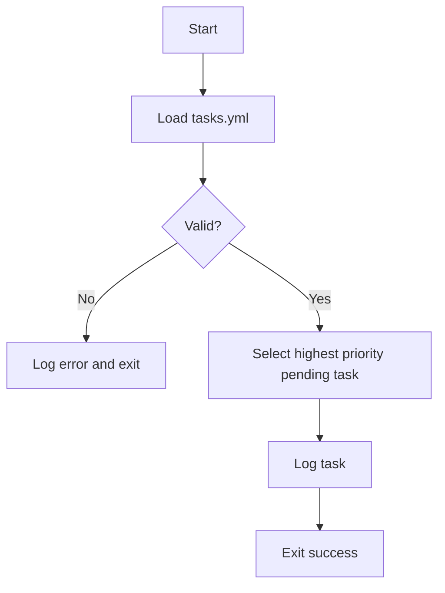
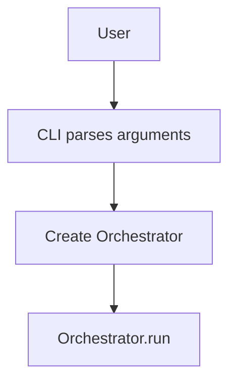

# System Architecture

## Components

### Orchestrator
Coordinates the main control loop for the self-improving system. It initializes with components like `Planner`, `Executor`, `Reflector`, and `Memory`. The `run` method orchestrates the primary workflow: loading tasks from persistence (e.g., `tasks.yml`) using `Memory`, invoking the `Reflector` to analyze the codebase and potentially generate new tasks (which are then saved back via `Memory`), and then entering a loop. In this loop, it uses the `Planner` to decide the next task, marks the task as "in_progress" (saving state), executes it using the `Executor`, and finally marks it as "done" (again, saving state). The loop continues until the `Planner` determines no more actionable tasks are available.

```python
class Orchestrator:
    """
    Coordinates the self-improving loop of task planning, execution, and reflection.
    """
    def __init__(self, planner, executor, reflector, memory):
        """
        Initializes the Orchestrator with necessary components.

        Args:
            planner: An instance of the Planner class.
            executor: An instance of the Executor class.
            reflector: An instance of the Reflector class.
            memory: An instance of the Memory class for loading/saving tasks.
        """
        self.planner = planner
        self.executor = executor
        self.reflector = reflector
        self.memory = memory

    def run(self, tasks_file: str = 'tasks.yml'):
        """
        Runs the main orchestration loop.

        The loop consists of:
        1. Loading tasks.
        2. Running a reflection cycle to potentially add/modify tasks.
        3. Iteratively planning, executing, and updating task statuses.

        Args:
            tasks_file (str): The name of the file from which to load and
                              to which to save tasks. Defaults to 'tasks.yml'.
        """
        # tasks = self.memory.load_tasks(tasks_file)
        # ... Full method implementation as in core/orchestrator.py
        pass # Placeholder for brevity in markdown
```

### CLI
Provides a thin command line wrapper around the `Orchestrator`. The
entrypoint defined in `core.cli` parses arguments, creates a `Memory`
instance and then runs the orchestrator.

```python
from pathlib import Path
from core.orchestrator import Orchestrator
from core.memory import Memory

def main(argv=None):
    parser = build_parser()
    args = parser.parse_args(argv)
    memory = Memory(Path(args.memory))
    orchestrator = Orchestrator(None, None, None, memory)
    orchestrator.run()
```

### Memory
Simple persistence helper for storing JSON state on disk. The API exposes
`load()`/`save()` for generic JSON data and `load_tasks()`/`save_tasks()`
for YAML task lists. All methods create parent directories as needed.

```python
from pathlib import Path
import json

class Memory:
    def __init__(self, path: Path):
        self.path = Path(path)

    def load(self):
        """Return stored data or an empty dict if no file exists."""
        pass

    def save(self, data):
        """Write data to disk creating directories as needed."""
        pass

    def load_tasks(self, tasks_file: str):
        """Return tasks from ``tasks_file`` or an empty list."""
        pass

    def save_tasks(self, tasks, tasks_file: str):
        """Write ``tasks`` back to ``tasks_file``."""
        pass
```

### Planner
The `Planner` is responsible for deciding which task should be executed next. Its `plan` method takes a list of all current tasks. It filters these tasks to find those that are ready to be executed: specifically, tasks that have a status of "todo" and whose declared dependencies (other tasks) have a status of "done". Among these eligible tasks, it selects the one with the highest `priority` value. If no tasks are ready, it returns `None`.

```python
class Planner:
    """
    A class that plans the execution order of tasks.
    It prioritizes tasks based on their priority and dependencies.
    """
    def plan(self, tasks: list) -> object | None:
        """
        Determines the next task to execute based on priority and dependencies.

        Tasks with higher priority are selected first.
        Tasks with dependencies are only selected if all their dependent tasks
        have a status of "done".

        Args:
            tasks: A list of task objects. Each task object is expected to have
                   at least the following attributes:
                   - id (any): A unique identifier for the task.
                   - priority (int): The priority of the task (higher value means higher priority).
                   - dependencies (list): A list of task IDs that this task depends on.
                   - status (str): The current status of the task (e.g., "todo", "done").

        Returns:
            The next task object to execute, or None if no tasks can be
            executed (e.g., all tasks are done, or pending tasks have unmet
            dependencies).
        """
        # todo_tasks = [task for task in tasks if hasattr(task, 'status') and task.status == "todo"]
        # ... Full method implementation as in core/planner.py
        pass # Placeholder for brevity in markdown
```

### Executor
The `Executor` is responsible for carrying out a given task. Currently, its `execute` method is a basic implementation. It takes a task object and prints its `description` attribute to standard output. If the task lacks a `description` but has an `id`, it prints the ID with a notification. If neither is present, it prints a generic message.

```python
class Executor:
    """
    A class responsible for executing tasks.
    """
    def execute(self, task: object) -> None:
        """
        Executes a given task.

        For now, this method simply prints the task's description
        to standard output. It assumes the task object has a 'description'
        attribute.

        Args:
            task: The task object to execute. Expected to have a
                  'description' attribute (e.g., task.description).
        """
        # if hasattr(task, 'description'):
        #     print(f"Executing task: {task.description}")
        # ... Full method implementation as in core/executor.py
        pass # Placeholder for brevity in markdown
```

### SelfAuditor
Evaluates code metrics and decides when refactors are required. Metrics are
obtained via **radon** (cyclomatic complexity and maintainability index) and,
optionally, **wily** for historical trends. The auditor never changes source
files itself. Instead it returns task dictionaries that the `Planner` appends to
`tasks.yml`. Each task describes the module, offending score and a brief
refactor suggestion.

```python
class SelfAuditor:
    def __init__(self, threshold: int = 15):
        self.threshold = threshold

    def analyze(self, paths):
        """Return a mapping of file paths to radon metrics."""

    def audit(self, tasks):
        """Return new task entries when complexity exceeds ``self.threshold``."""
```

After each execution cycle the `Orchestrator` calls `SelfAuditor.audit()` with
the current task list. Any returned entries are appended through the `Planner`,
which rewrites `tasks.yml` so that future iterations can schedule the
recommended refactors.

### Reflector
Coordinates a self-improvement cycle by scanning the repository and appending
new tasks when code complexity exceeds a threshold.

The `run_cycle` method performs the following steps:
1. Collect a list of Python files to analyze.
2. Compute cyclomatic complexity for each file.
3. Load existing tasks from ``tasks.yml``.
4. Create new refactor tasks when any file exceeds ``threshold``.
5. Save the updated task list back to disk.

```python
from pathlib import Path
import yaml
from radon.complexity import cc_visit


class Reflector:
    def __init__(self, tasks_path: Path, threshold: int = 10, paths=None):
        self.tasks_path = Path(tasks_path)
        self.threshold = threshold
        self.paths = [Path(p) for p in paths] if paths else None

    def run_cycle(self):
        files = self.paths or list(Path('.').rglob('*.py'))
        metrics = self._analyze(files)
        tasks = self._load_tasks()
        new = self._decide(metrics, tasks)
        if new:
            tasks.extend(new)
            self._save_tasks(tasks)
        return new
```

## Main Orchestration Loop
This diagram illustrates the primary control flow managed by the `Orchestrator`'s `run` method.

```mermaid
flowchart TD
    subgraph Orchestrator Run Cycle
        direction LR
        StartRun[Start run()] --> LoadTasks(Load tasks from Memory)
        LoadTasks --> RunReflector(Call Reflector.run_cycle())
        RunReflector --> SaveReflectedTasks(Save updated tasks to Memory)
        SaveReflectedTasks --> LoopDecision{Actionable task?}

        subgraph Task Execution Loop
            direction LR
            LoopDecision -- Yes --> PlanNext(Planner.plan())
            PlanNext --> TaskSelected{Task available?}
            TaskSelected -- Yes --> MarkInProgress(Update task: in_progress)
            MarkInProgress --> SaveInProgress(Save tasks to Memory)
            SaveInProgress --> ExecuteTask(Executor.execute())
            ExecuteTask --> MarkDone(Update task: done)
            MarkDone --> SaveDone(Save tasks to Memory)
            SaveDone --> LoopDecision
        end

        TaskSelected -- No --> EndLoop(End Loop)
        LoopDecision -- No --> EndLoop
        EndLoop --> FinishRun[Finish run()]
    end
```

## Bootstrapping Flow


## CLI Invocation Flow


## Dependencies
- **PyYAML==6.0.1** - Safe YAML parsing
- **pytest==7.4.0** - Test execution
- **jsonschema==4.21.0** - Validate task schema
- **radon==5.1.0** - Compute code complexity metrics
- **wily==1.25.0** - Track complexity over Git history
- **pylint==3.3.7** - Linting and style checks

## Persistence Strategy
State such as tasks and logs are stored on disk. Tasks are kept in `tasks.yml` and
logs are written to the `logs/` directory. Future components may store structured
state in JSON files or use lightweight databases like SQLite.
