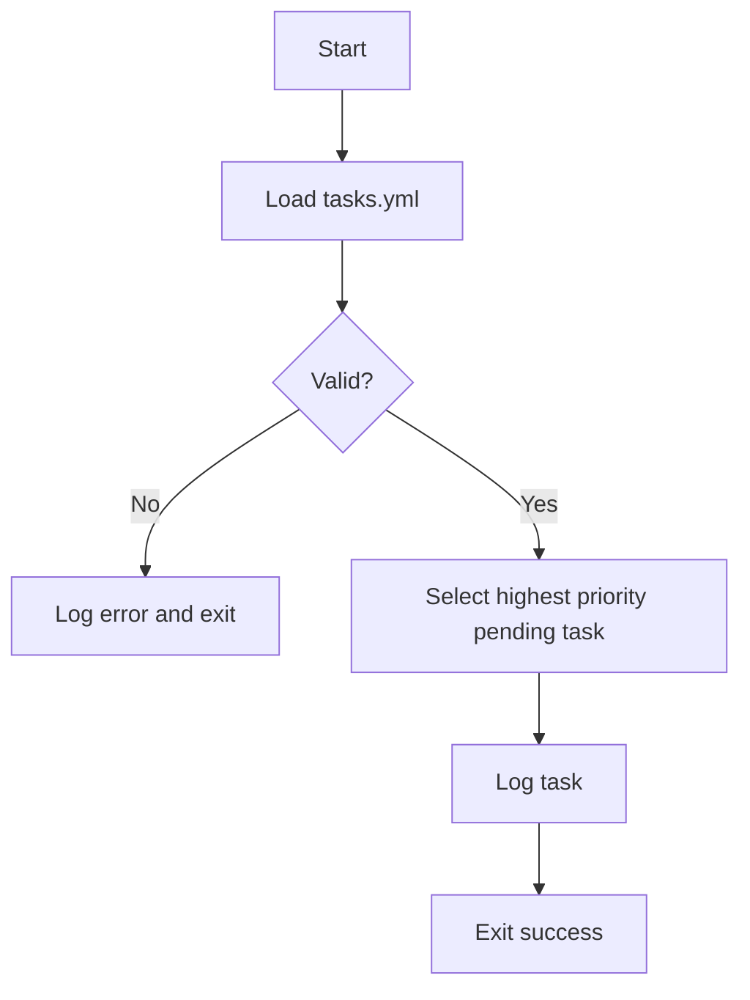
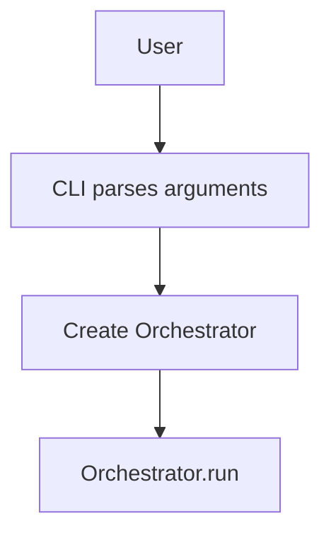

# System Architecture

## Components

### Orchestrator
Coordinates the main control loop. It loads persistent state from
`Memory`, asks the `Planner` for the next action, executes it via the
`Executor` and finally allows the `SelfAuditor` to inspect results. The
class simply wires these components together and exposes a `run()`
method that will later contain the orchestration logic.

```python
class Orchestrator:
    def __init__(self, planner, executor, auditor, memory):
        self.planner = planner
        self.executor = executor
        self.auditor = auditor
        self.memory = memory

    def run(self):
        """Entry point for the orchestration loop."""
        pass
```

### CLI
Provides a thin command line wrapper around the `Orchestrator`. The
entrypoint defined in `core.cli` parses arguments, creates a `Memory`
instance and then runs the orchestrator.

```python
from pathlib import Path
from core.orchestrator import Orchestrator
from core.memory import Memory

def main(argv=None):
    parser = build_parser()
    args = parser.parse_args(argv)
    memory = Memory(Path(args.memory))
    orchestrator = Orchestrator(None, None, None, memory)
    orchestrator.run()
```

### Memory
Simple persistence helper for storing JSON state on disk. The API is a
minimal pair of `load()` and `save()` methods which read from and write
to a configured file path.

```python
from pathlib import Path
import json

class Memory:
    def __init__(self, path: Path):
        self.path = Path(path)

    def load(self):
        """Return stored data or an empty dict if no file exists."""
        pass

    def save(self, data):
        """Write data to disk creating directories as needed."""
        pass
```

### Planner
```python
class Planner:
    def plan(self, tasks):
        pass
```

### Executor
```python
class Executor:
    def execute(self, task):
        pass
```

### SelfAuditor
Inspects code quality metrics and generates refactor tasks when complexity is
high. The initial implementation relies on **radon** to calculate cyclomatic
complexity for Python modules. Historical tracking with **wily** will be added
later. The auditor never mutates code directly; instead it returns a list of
new tasks for the `Planner` to merge into `tasks.yml`.

```python
class SelfAuditor:
    def __init__(self, threshold: int = 15):
        self.threshold = threshold

    def analyze(self, paths):
        """Return cyclomatic complexity metrics for ``paths`` using radon."""

    def audit(self, tasks):
        """Inspect complexity and return new task dictionaries when limits
        are exceeded."""
```

### Reflector
Coordinates the self-improvement loop by examining repository state and
invoking the `Orchestrator` to apply changes. It performs reflection,
analysis, decision making, execution and validation steps.

```python
class Reflector:
    def __init__(self, orchestrator):
        self.orchestrator = orchestrator

    def cycle(self):
        """Run one reflect-analyze-decide-execute iteration."""
        pass
```

## Bootstrapping Flow


## CLI Invocation Flow


## Dependencies
- **PyYAML==6.0.1** - Safe YAML parsing
- **pytest==7.4.0** - Test execution
- **jsonschema==4.21.0** - Validate task schema
- **radon==5.1.0** - Compute code complexity metrics
- **wily==1.25.0** - Track complexity over Git history
- **pylint==3.3.7** - Linting and style checks

## Persistence Strategy
State such as tasks and logs are stored on disk. Tasks are kept in `tasks.yml` and
logs are written to the `logs/` directory. Future components may store structured
state in JSON files or use lightweight databases like SQLite.
