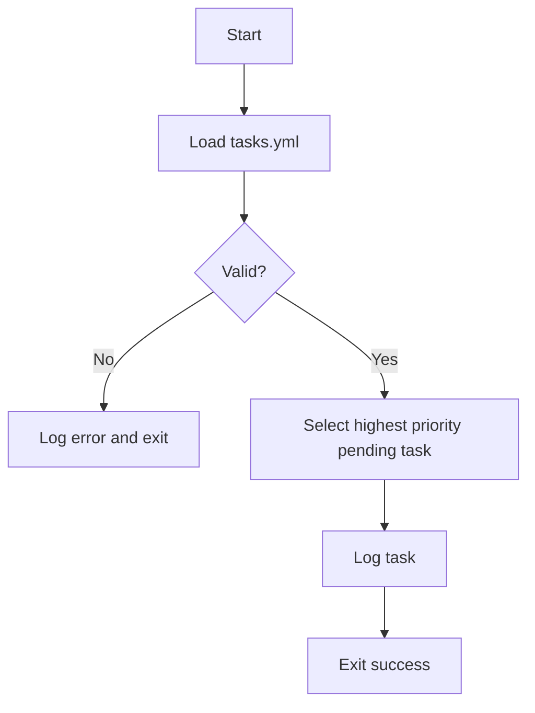

# System Architecture

## Components

### Orchestrator
```python
class Orchestrator:
    def __init__(self, planner, executor, auditor, memory):
        pass
    def run(self):
        pass
```

### Memory
```python
class Memory:
    def load(self):
        pass
    def save(self, data):
        pass
```

### Planner
```python
class Planner:
    def plan(self, tasks):
        pass
```

### Executor
```python
class Executor:
    def execute(self, task):
        pass
```

### SelfAuditor
```python
class SelfAuditor:
    def audit(self):
        pass
```

## Bootstrapping Flow


## Dependencies
- **PyYAML==6.0.1** - Safe YAML parsing
- **pytest==7.4.0** - Test execution
- **jsonschema==4.21.0** - Validate task schema

## Persistence Strategy
State such as tasks and logs are stored on disk. Tasks are kept in `tasks.yml` and
logs are written to the `logs/` directory. Future components may store structured
state in JSON files or use lightweight databases like SQLite.
