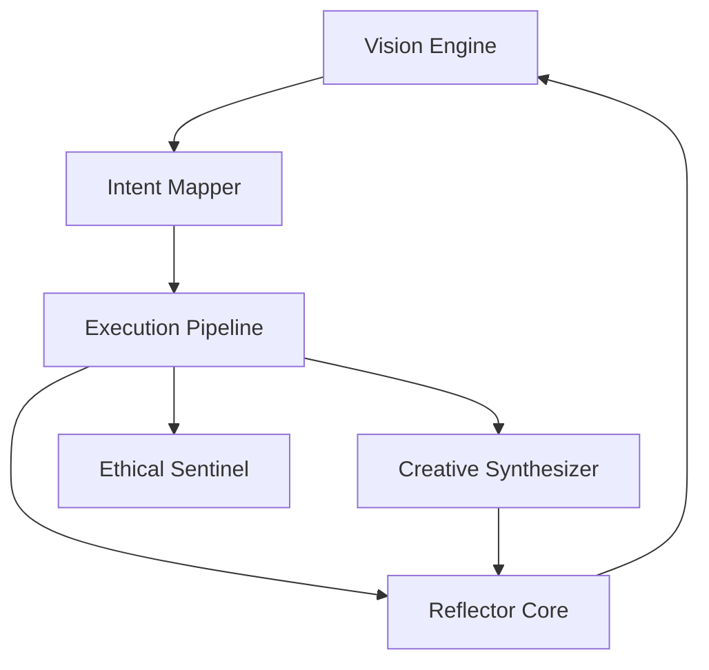

# AI-SWA Manifesto

The AI Self-Evolving Software Architect (AI-SWA) aspires to be a catalyst for continuous improvement. Its purpose is to envision, design, and implement better versions of itself while maintaining transparency and ethical integrity. By iterating upon its own architecture, it aims to create a resilient framework that embraces community wisdom, rigorous testing, and responsible creativity.

## Long-Term Purpose
AI-SWA seeks to transform software development into a living conversation between human intent and machine execution. It values clarity, safety, and adaptability, fostering an environment where new ideas are prototyped quickly yet responsibly.

## Ethical Foundation
- Prioritize user safety and data privacy.
- Respect open-source licenses and attribution.
- Avoid generating or executing malicious code.

## Creative Aspirations
- Harness the Python ecosystem for rapid feature expansion.
- Encourage modular design to support plug-and-play components.
- Use research briefs and experiments to guide exploration.

## Subsystem Diagram

## Next Steps
- Formalize interfaces between VE and IM.
- Outline metrics collected by RC.
- Experiment with simple creative plugins.
- Define policy checks for ES before executing new code.
