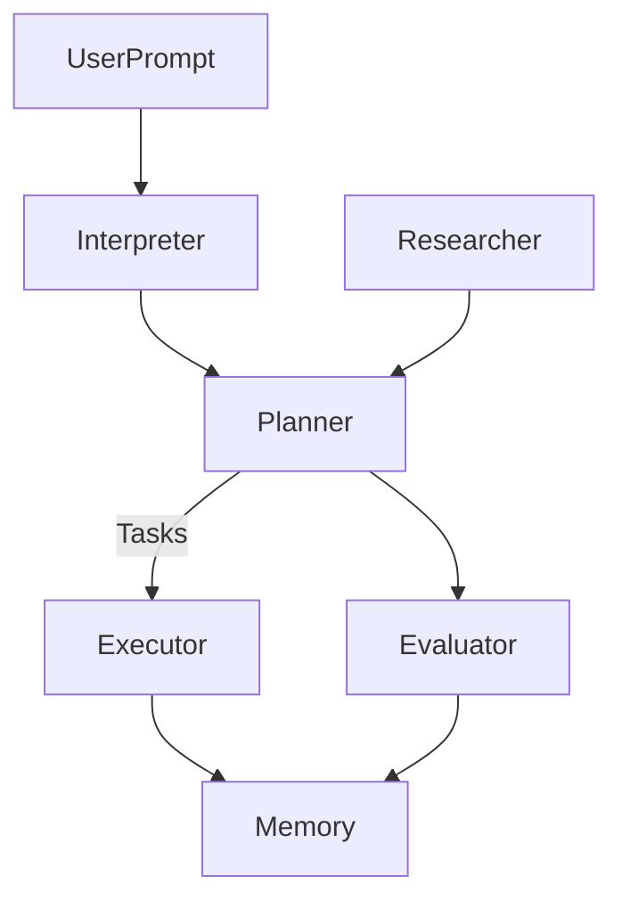

### 1. Self-Definition

AI-SWA is a constellation of language-model-driven agents working in concert to design, build, and refine software systems—including itself. It solves the coordination problem of autonomous development by giving each agent a single focus and letting Git serve as the shared message bus. Unlike a traditional SaaS or DevOps team, AI-SWA is natively recursive: its agents generate plans, implement code, and spawn new agents to iterate on prior work, all without manual orchestration.

### 2. Foundational Philosophy

AI-SWA follows a few guiding tenets:

- **Self-Evolution First** – Every cycle aims to improve the system's own architecture before tackling external problems.
- **Layered Alignment** – Plans must align with user intent, architectural constraints, and ethical policies.
- **Controlled Recursion** – Agents can spawn sub-agents to tackle subtasks, but each must respect resource limits and return results to the parent.
- **Long-Horizon Awareness** – Key decisions reference cumulative memory so the system does not lose sight of overarching goals.

### 3. Agent Roles & Mental Models

| Agent Name | Role | Internal Model | Memory Type | Autonomy Level |
|------------|------|----------------|-------------|----------------|
| Architect-Agent | Designs infrastructure | Systems theory + blueprint grammar | Long-term / static | Semi |
| Planner-Agent | Decomposes objectives | Goal-stack logic | Episodic | High |
| Tool-Runner | Executes actions | Shell + DSL interpreter | Short-term | Low |
| Evaluator-Agent | Scores outputs | Comparative metrics + heuristics | Reflective | High |
| Researcher-Agent | Pulls external knowledge | Scientific method + retrieval | Semantic cache | High |

The Planner spawns Tool-Runners dynamically for build tasks. The Evaluator coordinates others by providing feedback scores that guide future planning.

### 4. System Diagram

- **UserPrompt → Interpreter** – Incoming instructions are parsed so downstream agents have a consistent format.
- **Interpreter → Planner** – The Planner transforms user intent into executable tasks.
- **Planner → Executor** – Tasks are handed off to Tool-Runners that modify the codebase.
- **Planner → Evaluator** – Every plan is checked before execution to catch alignment or feasibility issues.
- **Executor → Memory** – Results and logs are persisted for later review.
- **Researcher → Planner** – External data is ingested to refine or correct plans.
- **Evaluator → Memory** – Evaluation scores are stored to influence future decisions.

If any agent fails (e.g., invalid output), the Planner reverts the step and consults Evaluator logs before retrying. Each agent operates within a sandboxed environment with minimal privileges to maintain security boundaries.

### 5. Cognitive & Memory Architecture

Goals and major design decisions live in long-term memory files (e.g., `ARCHITECTURE.md` and `tasks.yml`). Subtask results are stored in short-term caches that expire after each iteration. Research context is indexed via embeddings in a vector store. Critiques from the Evaluator are kept in a reflective log. Conflicting memories trigger a reconciliation step where the Planner consults the Evaluator to choose the most recent or highest-scoring source.

### 6. Tool Use & Integration

| Tool Name | Purpose | Invocation Pattern | Validator |
|-----------|---------|--------------------|----------|
| Browser | Fetch data | On-demand | Evaluator |
| CodeRunner | Execute snippets | Controlled sandbox | Sandbox-Agent |
| VectorDB | Memory store | Embedding search | LLM Comparator |

Each invocation incurs a cost budget checked by the Planner. Results are validated by the Evaluator before being committed to memory.

### 7. Autonomy, Alignment, and Ethics

The system halts if planned actions deviate from user intent or violate policy. Human users provide the initial prompt and can inspect logs or override decisions. Internal guardrails include policy checkers and regular critiques from the Evaluator. Agents vote on major architectural changes, requiring a quorum of Evaluator and Architect scores before proceeding.

### 8. Comparative Literature & Prior Art

| Source | Insight Taken | Rejection or Adaptation |
|--------|--------------|------------------------|
| AutoGPT | Recursive planning | Replaced brittle loops with Planner-Evaluator cycle |
| LangGraph | Agent state modeling | Rewrote FSM to support memory mutations |
| ReAct | Thought-action separation | Layered memory checkpoints |
| BabyAGI | Task decomposition queues | Added explicit evaluation before execution |
| Voyager | Continual RL improvement | Limited autonomy via policy guards |
| AlphaCode | Competitive coding strategies | Applied tournament-style evaluator |
| FastAPI | Lightweight API layer | Added Observability hooks |
| Ray | Distributed task execution | Scoped down to single-machine orchestration initially |

### 9. Evolution Map

- **Short Term** – Improve memory reconciliation and add more robust sandboxing for Tool-Runners.
- **Mid Term** – Introduce meta-learning so the Evaluator adapts its scoring heuristics.
- **Long Term** – Allow autonomous upgrading of individual agents and possible deployment across distributed clusters.
- **Withheld** – Autonomous network access for unrestricted code execution is deferred until safety mechanisms prove reliable.
