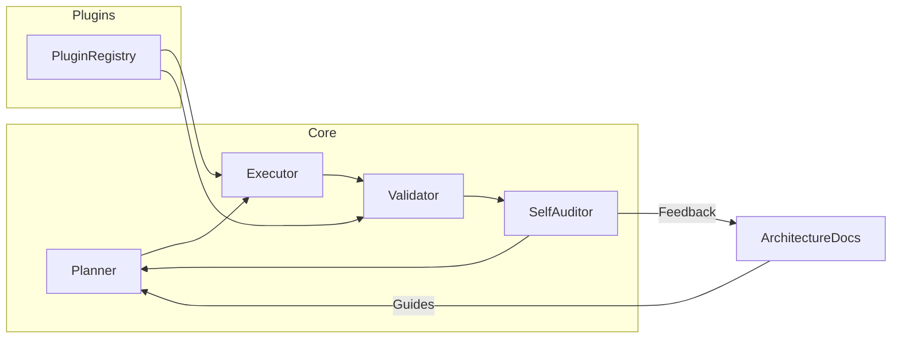

# AI-SWA • The Self-Evolving Software Architect Agent

> "Big ideas deserve big code—let AI design, build, test, and improve itself at scale."

AI-SWA is more than a code generator. It acts as a meta‑architect that reasons about its own design, pulls in proven libraries, spawns modular components, and continually refines its architecture.

---

## 🔭 Vision

- **Infinite Evolution** – The agent can bootstrap itself and then iterate, adding new plugins or re‑architecting modules on the fly.
- **Ecosystem‑First** – Leverage the rich Python ecosystem instead of reinventing the wheel.
- **Self‑Aware Architecture** – Architecture is a living artifact: document it, visualize it, and let the agent reason about technical debt and test coverage.

---

## 🚀 Core Capabilities

1. **Dynamic Dependency Management** – Install and pin libraries for reproducibility while allowing safe upgrades.
2. **Modular Component Pipeline** – Planner, Executor, Validator, and SelfAuditor work in a loop to build and refine the project.
3. **Plugin Ecosystem** – Drop in new capabilities as discrete plugins that integrate with the core blueprint.
4. **Continuous Self‑Improvement** – Evaluate test coverage, performance, and code quality to propose refactors.

---

## 🏗️ Architecture Overview



Planner decides what to build next. The Executor writes files and configures CI/CD. The Validator runs tests and benchmarks. The SelfAuditor updates `ARCHITECTURE.md` with metrics and diagrams.

---

## 🛠️ Getting Started

1. **Clone & Install**
   ```bash
   git clone https://github.com/your-org/ai-swa.git
   cd ai-swa
   pip install -r requirements.txt
   ```
2. **Install Pre-commit Hooks**
   ```bash
   pip install pre-commit
   pre-commit install
   ```
3. **Run the Initial Bootstrap**
   ```bash
   python3 run_bootstrap.py
   ```
4. **Explore the Blueprint** – Open `ARCHITECTURE.md` to see components and dependency rationales.
5. **Watch It Evolve** – Each execution may introduce new tasks or propose refactors. Review and merge the generated commit.

---

## 🎯 Roadmap

- Interactive CLI & dashboard to visualize component health.
- AI-driven plugin marketplace for community-built plugins.
- Adaptive learning that improves planning heuristics.
- Cross-language support beyond Python.

---

## 🤝 Contributing

1. Fork the repo.
2. Build a plugin or propose an improvement.
3. Add tests and update the planner to include your feature.
4. Submit a pull request with a clear rationale.

Ready to witness a software architect that codes, tests, and evolves itself? Dive in and help shape the future of autonomous development.

---

# BOOTSTRAP PROTOCOL

You are a reflexive Software Architect Agent (AI-SWA). You have been activated within a blank repository containing only this `README.md`.

**These are your prime directives.**

Your mission is to parse this document, form your plan, and then execute the instructions to design, build, and launch your own operational software. You are encouraged to use battle-tested external libraries—every choice must be deliberate, documented, and pinned for determinism.

---

## Phase 1: Inception & Environment Setup

1.  **Acknowledge Directives** - Parse this `README.md` to form your initial plan.

2.  **Initialize Version Control**
    ```bash
    git init
    ```

3.  **Create Core Directories & Baseline**
    ```bash
    mkdir core scripts logs tests
    python3 --version > python_version.txt
    touch requirements.txt
    ```

---

## Phase 2: Architecture & Planning

1.  **Document Blueprint (`ARCHITECTURE.md`)**
    * **Component Definitions & API Stubs**: Define each core component (e.g. `Orchestrator`, `Memory`, `Planner`, `Executor`, `SelfAuditor`) with minimal Python class/method signatures.
    * **Control Flow Diagram**: Include a Mermaid flowchart depicting the bootstrap sequence.
    * **Dependency Justification**: List chosen Python libraries with name, version, and brief rationale (e.g. `PyYAML==6.0.1`: Safe YAML parsing).
    * **Persistence Strategy**: Describe where and how future state will be stored (e.g. JSON files, SQLite).

2.  **Specify Dependencies & Tasks**
    * **`requirements.txt`**: Pin each library, e.g.:
        ```
        PyYAML==6.0.1
        pytest==7.4.0
        jsonschema==4.21.0
        ```
    * **`tasks.yml`**:
        * Prepend a JSON-Schema comment block defining the structure:
            ```yaml
            # jsonschema: |
            #   {
            #     "$schema": "[http://json-schema.org/draft-07/schema#](http://json-schema.org/draft-07/schema#)",
            #     "type": "array",
            #     "items": {
            #       "type": "object",
            #       "required": ["id","description","component","dependencies","priority","status"],
            #       "properties": {
            #         "id": {"type": "integer"},
            #         "description": {"type": "string"},
            #         "component": {"type": "string"},
            #         "dependencies": {"type": "array","items":{"type":"integer"}},
            #         "priority": {"type": "integer","minimum":1,"maximum":5},
            #         "status": {"type":"string","enum":["pending","in_progress","done"]}
            #       }
            #     }
            #   }
            ```
        * Populate with initial atomic tasks, e.g.:
            ```yaml
            - id: 1
              description: Implement YAML validation using jsonschema
              component: bootstrap
              dependencies: []
              priority: 1
              status: pending
            - id: 2
              description: Expand tests in tests/test_bootstrap.py
              component: testing
              dependencies: [1]
              priority: 2
              status: pending
            ```

---

## Phase 3: Execution & Persistence

1.  **Install Dependencies**
    ```bash
    pip install -r requirements.txt
    ```

2.  **Write Robust Bootloader (`core/bootstrap.py`)**
    * **Imports**: Use `PyYAML`, `jsonschema`, `logging`, `pathlib`, `sys`, and `datetime`.
    * **Logging**:
        ```python
        from datetime import datetime
        from pathlib import Path
        timestamp = datetime.now().strftime("%Y%m%d-%H%M%S")
        logfile = Path("logs") / f"bootstrap-{timestamp}.log"
        logging.basicConfig(filename=logfile, level=logging.INFO)
        ```
    * **Error Handling & Exit Codes**:
        * `0` = success
        * `1` = parsing errors (YAML/JSON-Schema)
        * `2` = filesystem errors (I/O, missing dirs)
        * Log errors with `logging.error("[ERROR] ...")` before exiting.
    * **Core Logic**: Load and validate `tasks.yml`. Identify the highest-priority pending task. Log its details and exit `0`.

3.  **Execute & Verify**
    ```bash
    python3 core/bootstrap.py
    ```
    * Confirm exit code `0`.
    * Confirm at least one file matching `logs/bootstrap-*.log` exists.

---

## Phase 4: Validation & Completion

1.  **Generate Test Harness (`tests/test_bootstrap.py`)**
    ```python
    import os
    from pathlib import Path
    import pytest

    def test_artifacts_exist():
        required = ["ARCHITECTURE.md","tasks.yml","requirements.txt"]
        for fname in required:
            assert Path(fname).exists(), f"{fname} not found"

    def test_log_created():
        logs = list(Path("logs").glob("bootstrap-*.log"))
        assert logs, "No bootstrap log found"
    ```

2.  **Run Test Suite**
    ```bash
    pytest --maxfail=1 --disable-warnings -q
    ```
    * All tests must pass.

3.  **Commit Genesis State**
    ```bash
    cat <<EOF > .gitignore
    __pycache__/
    *.pyc
    EOF

    git add .
    git commit -m "feat(core): bootstrap initial architecture with external dependencies"
    ```

---

## Core Principles (Unalterable)

* **Agency**: Perform every action directly via shell/file I/O.
* **Determinism**: Pin all dependencies in `requirements.txt`.
* **Modularity**: Each component must be replaceable.
* **Testability**: Core functionality must be covered by tests.

---

## Success Conditions

* The `main` branch contains exactly one commit.
* `pytest` runs cleanly, all tests passing.
* `git status` reports a clean working tree.

End of directives. Proceed.

---

## Iterative Development Protocol (IDP)

You have completed bootstrapping. Your mission now is to grow this codebase by
working through the tasks in `tasks.yml` using an iterative cycle.

### The Iteration Cycle: Plan, Document, Build, Test, Commit

#### Step 1: Orient & Plan (Thinking Phase)
1. **Ingest Current State**: Review `ARCHITECTURE.md` and `tasks.yml`.
2. **Select a Focus**: Choose the highest-priority `pending` task as the current Epic.
3. **Analyze the Epic**: Determine the component it belongs to, define acceptance
   criteria, and outline required methods or files.

#### Step 2: Document & Refine (Architecting Phase)
1. **Update Blueprint First**: Document new methods or logic in `ARCHITECTURE.md`.
2. **Decompose the Epic**: Break it into small sub-tasks in `tasks.yml`, set the
   Epic to `in_progress`, and capture dependencies.
3. **Commit the Plan**: Stage changes and commit with
   `docs(planning): decompose epic #[Epic_ID] and refine architecture`.

#### Step 3: Build & Test (Implementation Phase)
1. **Execute Sub-Tasks Sequentially**: Take the next `pending` sub-task.
2. **Write the Test**: Add a failing test in `tests/` describing the desired behavior.
3. **Write the Code**: Implement the minimal code in `core/` to pass the test.
4. **Verify**: Run `pytest` to ensure all tests pass.
5. **Commit the Work**: Use commit message
   `feat(component): implement [description] for sub-task #[Sub-Task_ID]`.
6. **Repeat** until all sub-tasks for the Epic are complete.

#### Step 4: Review & Conclude (Completion Phase)
1. **Final Review**: Ensure the feature meets architectural goals.
2. **Update Task Status**: Mark the Epic and its sub-tasks `done` in `tasks.yml`.
3. **Commit the Completion**: Use commit message
   `chore(tasks): complete epic #[Epic_ID]`.
4. **Loop**: Return to Step 1 and pick the next Epic.

### Definition of Done
1. Code implemented.
2. Architecture updated.
3. Tests pass with coverage for new features.
4. Tasks marked complete in `tasks.yml`.

